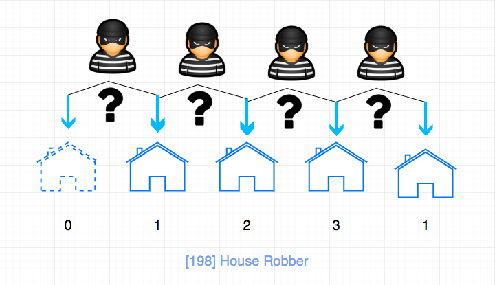
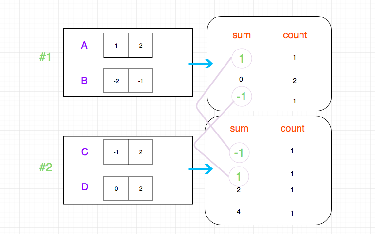

# 前言

   

    

简体中文 \| [English](https://github.com/azl397985856/leetcode/tree/2ee1bc113a28d207e232df0a487e008ac48ee411/README.en.md)

* 2019-07-10 ：[纪念项目 Star 突破 1W 的一个短文](https://github.com/azl397985856/leetcode/tree/2ee1bc113a28d207e232df0a487e008ac48ee411/thanksGiving.md)， 记录了项目的"兴起"之路，大家有兴趣可以看一下，如果对这个项目感兴趣，请**点击一下 Star**， 项目会**持续更新**，感谢大家的支持。
* 2019-10-08: [纪念 LeetCode 项目 Star 突破 2W](https://github.com/azl397985856/leetcode/tree/2ee1bc113a28d207e232df0a487e008ac48ee411/thanksGiving2.md)，并且 Github 搜索“LeetCode”，排名第一。
* 2020-04-12: [项目突破三万 Star](https://github.com/azl397985856/leetcode/tree/2ee1bc113a28d207e232df0a487e008ac48ee411/thanksGiving3.md)。
* 2020-04-14: 官网`力扣加加`上线啦 💐💐💐💐💐，有专题讲解，每日一题，下载区和视频题解，后续会增加更多内容，还不赶紧收藏起来？地址：[http://leetcode-solution.cn/](http://leetcode-solution.cn/)

## 项目预览

可以清晰地看出仓库组织关系。

（你可以下载本仓库 和 obsidian 软件，然后用 obsidian 打开获得更好的阅读效果）

## 介绍

leetcode 题解，记录自己的 leetcode 解题之路。

本仓库目前分为**五个**部分：

* 第一个部分是 leetcode 经典题目的解析，包括思路，关键点和具体的代码实现。
* 第二部分是对于数据结构与算法的总结
* 第三部分是 anki 卡片， 将 leetcode 题目按照一定的方式记录在 anki 中，方便大家记忆。
* 第四部分是每日一题，每日一题是在交流群（包括微信和 qq）里进行的一种活动，大家一起 解一道题，这样讨论问题更加集中，会得到更多的反馈。而且 这些题目可以被记录下来，日后会进行筛选添加到仓库的题解模块。
* 第五部分是计划， 这里会记录将来要加入到以上三个部分内容

> 只有熟练掌握基础的数据结构与算法，才能对复杂问题迎刃有余。

## 非科学人士看过来

如果是国内的非科学用户，可以使用 [https://lucifer.ren/leetcode](https://lucifer.ren/leetcode) ，整站做了静态化，速度贼快！但是阅读体验可能一般，大家也可以访问[力扣加加](http://leetcode-solution.cn/)（暂时没有静态化）获得更好的阅读体验。

另外需要科学的，我推荐一个工具， 用户体验真的是好，用起来超简单， 提供一站式工具，包括网络检测工具，浏览器插件等，支持多种客户端（还有我最喜欢的 Switch 加速器），价格也不贵，基础套餐折算到月大约 11.2 块/月。它还支持签到送天数，也就是说你可以每天签到无限续期。地址：[https://glados.space/landing/M9OHH-Q88JQ-DX72D-R04RN](https://glados.space/landing/M9OHH-Q88JQ-DX72D-R04RN)

## 怎么刷 LeetCode？

* [我是如何刷 LeetCode 的](https://www.zhihu.com/question/280279208/answer/824585814)
* [算法小白如何高效、快速刷 leetcode？](https://www.zhihu.com/question/321738058/answer/1279464192)

## 刷题插件

* [刷题效率低？或许你就差这么一个插件](https://lucifer.ren/blog/2020/06/06/algo-chrome-extension/)
* [力扣刷题插件](https://lucifer.ren/blog/2020/08/16/leetcode-cheat/)

## 91 天学算法

* [91 天，遇见不一样的自己](https://lucifer.ren/blog/2020/05/30/91algo-05-30/)

## 食用指南

* 对于最近添加的部分， 后面会有 🆕 标注
* 对于最近更新的部分， 后面会有 🖊 标注
* 这里有一张互联网公司面试中经常考察的问题类型总结的思维导图，我们可以结合图片中的信息分析一下。

（图片来自 leetcode\)

其中算法，主要是以下几种：

* 基础技巧：分治、二分、贪心
* 排序算法：快速排序、归并排序、计数排序
* 搜索算法：回溯、递归、深度优先遍历，广度优先遍历，二叉搜索树等
* 图论：最短路径、最小生成树
* 动态规划：背包问题、最长子序列

数据结构，主要有如下几种：

* 数组与链表：单 / 双向链表
* 栈与队列
* 哈希表
* 堆：最大堆 ／ 最小堆
* 树与图：最近公共祖先、并查集
* 字符串：前缀树（字典树） ／ 后缀树

## 精彩预告

[0042.trapping-rain-water](https://github.com/azl397985856/leetcode/tree/2ee1bc113a28d207e232df0a487e008ac48ee411/problems/42.trapping-rain-water.md):

[0547.friend-circles](https://github.com/azl397985856/leetcode/tree/2ee1bc113a28d207e232df0a487e008ac48ee411/problems/547.friend-circles-en.md):

[backtrack problems](https://github.com/azl397985856/leetcode/tree/2ee1bc113a28d207e232df0a487e008ac48ee411/problems/90.subsets-ii.md):

[0198.house-robber](easy/198.house-robber.md):

[0454.4-sum-ii](https://github.com/azl397985856/leetcode/tree/2ee1bc113a28d207e232df0a487e008ac48ee411/problems/454.4-sum-ii.md):

### anki 卡片

Anki 主要分为两个部分：一部分是关键点到题目的映射，另一部分是题目到思路，关键点，代码的映射。

全部卡片都在 [anki-card](https://github.com/azl397985856/leetcode/tree/2ee1bc113a28d207e232df0a487e008ac48ee411/assets/anki/leetcode.apkg)

使用方法：

anki - 文件 - 导入 - 下拉格式选择“打包的 anki 集合”，然后选中你下载好的文件，确定即可。

更多关于 anki 使用方法的请查看 [anki 官网](https://apps.ankiweb.net/)

目前已更新卡片一览（仅列举正面）：

* 二分法解决问题的关键点是什么，相关问题有哪些？
* 如何用栈的特点来简化操作， 涉及到的题目有哪些？
* 双指针问题的思路以及相关题目有哪些？
* 滑动窗口问题的思路以及相关题目有哪些？
* 回溯法解题的思路以及相关题目有哪些？
* 数论解决问题的关键点是什么，相关问题有哪些？
* 位运算解决问题的关键点是什么，相关问题有哪些？

> 已加入的题目有：\#2 \#3 \#11

### 每日一题

每日一题是在交流群（包括微信和 qq）里通过 issues 来进行的一种活动，大家一起 解一道题，这样讨论问题更加集中，会得到更多的反馈。而且 这些题目可以被记录下来，日后会进行筛选添加到仓库的题解模块。

* [每日一题汇总](https://github.com/azl397985856/leetcode/tree/2ee1bc113a28d207e232df0a487e008ac48ee411/daily/README.md)
* [每日一题认领区](https://github.com/azl397985856/leetcode/projects/1)

### 计划

* LeetCode 换皮题目集锦
* 动态规划完善。最长递增子序列，最长回文子序列，编辑距离等“字符串”题目， 扔鸡蛋问题。 解题模板，滚动数组。
* 堆可以解决的题目。 手写堆
* 单调栈
* BFS & DFS

## 哪里能找到我？

点关注，不迷路。如果再给 ➕ 个星标就更棒啦！

> 关注加加，星标加加～

## 关于我

擅长前端工程化，前端性能优化，前端标准化等，做过。net， 搞过 Java，现在是一名前端工程师，我的个人博客：[https://lucifer.ren/blog/](https://lucifer.ren/blog/)

我经常会在开源社区进行一些输出和分享，比较受欢迎的有 [宇宙最强的前端面试指南](https://github.com/azl397985856/fe-interview) 和 [我的第一本小书](https://github.com/azl397985856/automate-everything)。目前本人正在写一本关于《leetcode 题解》的实体书，感兴趣的可以通过邮箱或者微信联系我，我会在出版的第一时间通知你，并给出首发优惠价。有需要可以直接群里联系我，或者发送到我的个人邮箱 \[azl397985856@gmail.com\]。 新书详情戳这里：[《或许是一本可以彻底改变你刷 LeetCode 效率的题解书》](https://lucifer.ren/blog/2020/04/07/leetcode-book.intro/)

## 贡献

* 如果有想法和创意，请提 [issue](https://github.com/azl397985856/leetcode/issues) 或者进群提
* 如果想贡献增加题解或者翻译， 可以参考[贡献指南](https://github.com/azl397985856/leetcode/tree/2ee1bc113a28d207e232df0a487e008ac48ee411/CONTRIBUTING.md)

  > 关于如何提交题解，我写了一份 [指南](https://github.com/azl397985856/leetcode/tree/2ee1bc113a28d207e232df0a487e008ac48ee411/templates/problems/1014.best-sightseeing-pair.md)

* 如果需要修改项目中图片，[这里](https://github.com/azl397985856/leetcode/tree/2ee1bc113a28d207e232df0a487e008ac48ee411/assets/drawio/README.md) 存放了项目中绘制图的源代码， 大家可以用 [draw.io](https://www.draw.io/) 打开进行编辑。

## 鸣谢

感谢为这个项目作出贡献的所有 [小伙伴](https://github.com/azl397985856/leetcode/graphs/contributors)

## License

[CC BY-NC-ND 4.0](https://github.com/azl397985856/leetcode/tree/2ee1bc113a28d207e232df0a487e008ac48ee411/LICENSE.txt)

